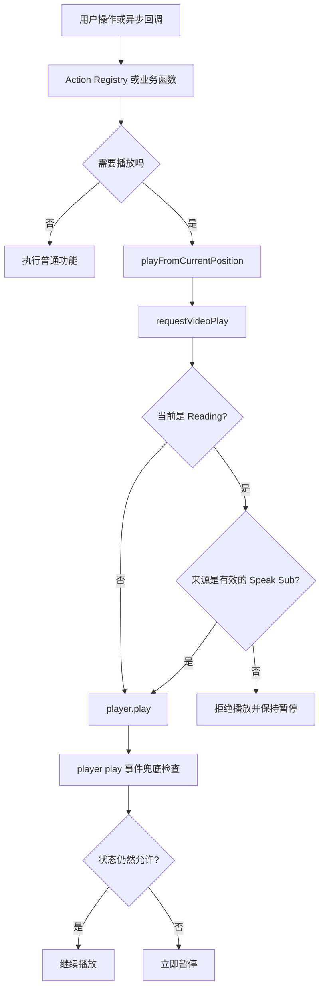
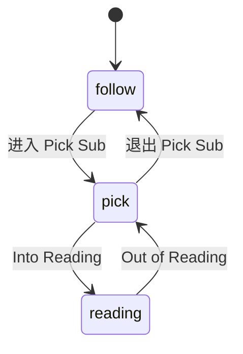

# 用“单一状态源 + 功能权限表 + 播放统一入口”管理视频字幕交互

## 1. 文档目的

视频播放器中的功能经常互相影响。例如，本项目的字幕阅读模式有以下规则：

- 进入 Reading 后必须暂停视频；
- Reading 状态下禁止用户手动播放；
- `Speak Sub` 仍然可以临时播放当前字幕；
- 离开 Reading 后恢复普通的播放权限；
- 播放按钮、快捷键、自动播放和代码内部的播放请求必须遵守同一套规则。

如果每一个按钮、快捷键和回调都分别判断这些条件，规则会很快散落到各处，出现“按钮禁用了，但快捷键还能播放”或“一个新入口忘记检查 Reading 状态”等问题。

本项目采用的解决方法可以概括为：

> 用一个权威状态描述当前交互模式；由该状态推导功能权限；所有播放请求经过同一个入口进行权限检查。

这就是“单一状态源 + 功能权限表 + 播放统一入口”。

相关实现主要位于：

- [`src/renderer/modes/VideoMode.jsx`](src/renderer/modes/VideoMode.jsx)
- [`src/renderer/actions/actionRegistry.js`](src/renderer/actions/actionRegistry.js)
- [`src/renderer/components/rollingSubtitle/RollingSubtitlePanel.jsx`](src/renderer/components/rollingSubtitle/RollingSubtitlePanel.jsx)

---

## 2. 三个组成部分

### 2.1 单一状态源

“单一状态源”是指：同一种业务状态只由一个权威变量表示，不再另外维护一批可能互相矛盾的布尔值。

本项目没有使用下面这种结构：

```js
const [isPickingSubtitle, setIsPickingSubtitle] = useState(false)
const [isReadingSubtitle, setIsReadingSubtitle] = useState(false)
const [isFollowingSubtitle, setIsFollowingSubtitle] = useState(true)
```

三个布尔值可能产生不合法组合，例如：

```text
isPickingSubtitle = true
isReadingSubtitle = true
isFollowingSubtitle = true
```

代码无法从这个组合判断当前究竟是什么状态。

本项目使用一个互斥状态：

```js
const [subtitleInteractionMode, setSubtitleInteractionMode] = useState('follow')
```

其合法值为：

| 状态 | 含义 |
| --- | --- |
| `follow` | 普通播放状态，字幕跟随视频时间移动 |
| `pick` | Pick Sub 状态，可以勾选、编辑和保存字幕 |
| `reading` | Pick Sub 的阅读子模式，字幕成为静态阅读视图 |

任意时刻只能有一个值，因此不会同时处于多个互斥模式。

### 2.2 功能权限表

交互状态本身只回答“现在处于什么模式”。界面和命令还需要知道“当前允许做什么”。

本项目从 `subtitleInteractionMode` 和当前字幕环境推导权限：

```js
const subtitleCapabilities = {
  canManualPlay: subtitleInteractionMode !== 'reading',
  canReadByWheel: subtitleInteractionMode === 'reading',
  canEditSubtitle:
    subtitleInteractionMode === 'pick'
    || subtitleInteractionMode === 'reading',
  canSpeakSubtitle: canPickRollingSubtitle,
  canToggleReading:
    subtitleInteractionMode === 'pick'
    || subtitleInteractionMode === 'reading',
}
```

这里的 `subtitleCapabilities` 就是功能权限表。调用方不必重新理解完整的状态机，只需要查询与自己有关的能力。

例如播放按钮只关心：

```jsx
<button
  data-tooltip={
    subtitleCapabilities.canManualPlay
      ? 'Play / Pause'
      : 'Exit Sub Reading before playback'
  }
  disabled={
    !subtitleCapabilities.canManualPlay
    && playerRef.current?.paused?.() !== false
  }
  onClick={() => runAction('video.togglePlay')}
>
  Play
</button>
```

右键菜单也只查询能力：

```js
{
  label: 'Edit Sub',
  disabled: !subtitleCapabilities.canEditSubtitle,
  action: () => editSubtitleCue(contextMenu.cue),
}

{
  label: 'Speak Sub',
  disabled:
    !subtitleCapabilities.canSpeakSubtitle
    || !contextMenu.playerPaused,
  action: () => speakSubtitleCue(contextMenu.cue),
}

{
  label:
    subtitleInteractionModeRef.current === 'reading'
      ? 'Out of Reading'
      : 'Into Reading',
  disabled: !subtitleCapabilities.canToggleReading,
  action: toggleSubtitleReading,
}
```

这样做有两个好处：

1. 权限规则集中在一个位置，容易检查和修改；
2. UI 不需要复制业务判断，只负责根据权限显示、禁用或执行功能。

### 2.3 播放统一入口

仅仅禁用播放按钮并不安全，因为播放还有很多来源：

- 点击播放按钮；
- 播放快捷键；
- 切换视频后的自动播放；
- 跳转到笔记时间后播放；
- 其他异步回调；
- `Speak Sub` 的临时播放。

因此，真正的权限检查必须放在播放入口，而不是只放在 UI 上。

本项目的底层播放入口是 `requestVideoPlay()`：

```js
const requestVideoPlay = ({ source = 'manual', silent = false } = {}) => {
  const player = playerRef.current
  if (!player?.play) return false

  const speakPreview =
    source === 'speak-sub'
    && speakSubtitlePreviewRef.current

  if (
    subtitleInteractionModeRef.current === 'reading'
    && !speakPreview
  ) {
    player.pause?.()

    if (!silent) {
      showAutoMessage(
        'Exit Sub Reading before playback.',
        'Subtitle Reading',
        1400,
      )
    }

    return false
  }

  const result = player.play()

  if (result?.catch) {
    result.catch(() => {
      if (!silent) {
        showAutoMessage('Action message.', 'Message', 1800)
      }
    })
  }

  return true
}
```

该函数负责：

1. 确认播放器可用；
2. 判断播放来源；
3. 检查当前交互状态是否允许播放；
4. 拒绝不合法播放并保持暂停；
5. 只有通过检查后才调用 `player.play()`；
6. 统一处理异步播放失败。

上层的播放逻辑不再直接调用 Video.js：

```js
const playFromCurrentPosition = (options = {}) => {
  const player = playerRef.current
  if (!player?.play) return false

  if (
    subtitleInteractionModeRef.current === 'reading'
    && options.source !== 'speak-sub'
  ) {
    return requestVideoPlay(options)
  }

  const tryPlay = () => {
    requestVideoPlay(options)
  }

  tryPlay()
  player.one?.('seeked', tryPlay)
  setTimeout(tryPlay, 80)
  return true
}
```

这里多次尝试播放是为了兼容播放器跳转和媒体加载的异步时序，但每一次尝试仍会经过 `requestVideoPlay()`，不会绕过权限。

---

## 3. 整体控制流程



这条链路把“谁发起播放”和“是否允许播放”分开：

- 按钮、快捷键等负责表达意图；
- 播放入口负责执行规则；
- 播放器事件负责最后兜底。

---

## 4. 本项目的字幕状态机

### 4.1 允许的状态转换

项目通过 `changeSubtitleInteractionMode()` 统一修改字幕交互状态：

```js
const changeSubtitleInteractionMode = (nextMode) => {
  const currentMode = subtitleInteractionModeRef.current

  const allowed =
    (currentMode === 'follow' && nextMode === 'pick')
    || (currentMode === 'pick'
      && ['follow', 'reading'].includes(nextMode))
    || (currentMode === 'reading' && nextMode === 'pick')
    || currentMode === nextMode

  if (!allowed) return false

  if (currentMode === 'reading' && nextMode !== 'reading') {
    stopSpeakSubtitleRef.current?.()
    saveCurrentReadingPosition()
    readingSessionRef.current = null
  }

  if (nextMode === 'reading') {
    playerRef.current?.pause?.()
  }

  if (nextMode !== 'reading') {
    setSubtitleReadingStatus(null)
  }

  subtitleInteractionModeRef.current = nextMode
  setSubtitleInteractionMode(nextMode)
  return true
}
```

转换关系为：



Reading 是 Pick Sub 的子工作流，所以不允许从 `follow` 直接进入 `reading`，也不允许从 `reading` 直接跳到 `follow`。

### 4.2 状态转换函数同时处理副作用

状态切换不仅仅是修改字符串，还需要完成与转换相关的清理：

- 进入 Reading 时立即暂停播放器；
- 离开 Reading 时停止 `Speak Sub`；
- 保存当前阅读位置；
- 清空 Reading session；
- 清除 Reading 状态栏信息。

这些副作用集中在转换函数中，可以避免某个入口只修改状态、却忘记暂停或保存位置。

---

## 5. 为什么同时使用 React state 和 ref

项目中同时存在：

```js
const [subtitleInteractionMode, setSubtitleInteractionMode] = useState('follow')
const subtitleInteractionModeRef = useRef('follow')
```

这不代表存在两个独立的业务状态源。两者保存相同的模式，但服务于不同的运行环境：

- React state 用于重新渲染界面和推导 `subtitleCapabilities`；
- ref 用于计时器、播放器事件、Promise 回调等异步代码，立即读取最新状态。

普通同步关系是：

```js
useEffect(() => {
  subtitleInteractionModeRef.current = subtitleInteractionMode
}, [subtitleInteractionMode])
```

在状态转换函数中还会立即更新 ref：

```js
subtitleInteractionModeRef.current = nextMode
setSubtitleInteractionMode(nextMode)
```

这样，在 React 完成下一次渲染之前，播放器事件也能读取到新状态。

重要约束是：

> ref 不是第二套可独立修改的业务状态。所有正常状态转换仍应经过 `changeSubtitleInteractionMode()`。

如果任意代码随意修改 ref，就会重新产生两个状态源不一致的问题。

---

## 6. 播放按钮和快捷键如何汇聚

本项目使用 Action Registry 抽象功能命令。播放相关命令注册为：

```js
registerActions([
  {
    id: 'video.togglePlay',
    label: 'Play / Pause',
    scope: APP_MODES.VIDEO,
    handler: togglePlayPause,
  },
  {
    id: 'video.togglePlayAlt',
    label: 'Play / Pause Alt',
    scope: APP_MODES.VIDEO,
    handler: togglePlayPause,
  },
])
```

按钮调用命令：

```jsx
onClick={() => runAction('video.togglePlay')}
```

快捷键管理器也调用同一个命令：

```js
runAction(actionId)
```

两个入口最终都会进入：

```js
const togglePlayPause = () => {
  const player = playerRef.current
  if (!player) return

  if (player.paused?.()) {
    playFromCurrentPosition()
    return
  }

  player.pause?.()
}
```

因此流程是：

```text
播放按钮 ─┐
          ├─> Action Registry ─> togglePlayPause
播放快捷键 ┘                         │
                                      v
                         playFromCurrentPosition
                                      │
                                      v
                            requestVideoPlay
```

Reading 下，即使某个快捷键仍然触发了播放命令，最终也会在 `requestVideoPlay()` 被拒绝。

---

## 7. Speak Sub：受控例外，而不是绕过权限

### 7.1 为什么需要例外

Reading 的业务规则是“禁止用户恢复正常播放”，但 `Speak Sub` 的业务规则是“播放器暂停时，临时播放当前句子的完整内容，然后再次暂停”。

它不是恢复普通播放，而是一个有边界、会自动结束的预览动作。

### 7.2 使用明确的播放来源

调用时明确声明来源：

```js
requestVideoPlay({ source: 'speak-sub' })
```

统一入口不会仅凭字符串就放行，还会检查预览生命周期状态：

```js
const speakPreview =
  source === 'speak-sub'
  && speakSubtitlePreviewRef.current
```

只有同时满足以下条件才获得例外权限：

1. 请求明确来自 `speak-sub`；
2. `Speak Sub` 预览确实已经进入活动状态。

这比简单写成下面这样更安全：

```js
// 不推荐：任何代码伪造 source 都能播放。
if (source === 'speak-sub') {
  player.play()
}
```

### 7.3 Speak Sub 的完整生命周期

简化后的实现如下：

```js
const speakSubtitleCue = (cue) => {
  const player = playerRef.current

  if (
    !player
    || player.paused?.() === false
    || !subtitleCapabilities.canSpeakSubtitle
  ) {
    return
  }

  if (!Number.isFinite(cue?.start) || !Number.isFinite(cue?.end)) {
    return
  }

  stopSpeakSubtitlePreview()

  const startTime = cue.start
  const endTime = cue.end

  const finishPreview = () => {
    player.off?.('timeupdate', handlePreviewTimeUpdate)
    player.off?.('ended', finishPreview)
    player.pause?.()
    player.currentTime?.(endTime)
    speakSubtitlePreviewRef.current = false
  }

  const handlePreviewTimeUpdate = () => {
    if (Number(player.currentTime?.()) >= endTime) {
      finishPreview()
    }
  }

  speakSubtitlePreviewRef.current = true
  player.currentTime?.(startTime)
  player.on?.('timeupdate', handlePreviewTimeUpdate)
  player.on?.('ended', finishPreview)

  if (!requestVideoPlay({ source: 'speak-sub' })) {
    finishPreview()
  }
}
```

关键点是：

- Reading 状态没有被临时改成 `pick` 或 `follow`；
- 权威状态始终保持为 `reading`；
- 例外被限制在 `Speak Sub` 的生命周期内；
- 播放到字幕结束时间后自动暂停并撤销例外权限。

如果为了播放一句字幕而临时退出 Reading，再重新进入，会引发额外的保存位置、恢复位置、UI 重绘和状态栏更新，反而更容易产生冲突。

---

## 8. 防御性兜底

即使项目要求所有播放都通过统一入口，第三方播放器自身或未来新增代码仍可能直接触发播放。为此，本项目监听播放器的 `play` 事件：

```js
const onPlayerReady = (player) => {
  playerRef.current = player

  player.on('play', () => {
    if (
      subtitleInteractionModeRef.current !== 'reading'
      || speakSubtitlePreviewRef.current
    ) {
      return
    }

    player.pause?.()
    showAutoMessage(
      'Exit Sub Reading before playback.',
      'Subtitle Reading',
      1400,
    )
  })
}
```

这是“纵深防御”：

1. UI 权限防止用户看到或点击不适用的功能；
2. Action Registry 让按钮和快捷键共享相同行为；
3. `requestVideoPlay()` 是正式执行边界；
4. 播放器 `play` 事件阻止意外绕过。

兜底事件不是统一入口的替代品。仅依靠 `play` 事件，播放器可能先播放极短时间再被暂停，其他监听器也可能已经收到播放事件。因此应优先在 `requestVideoPlay()` 中拒绝请求。

---

## 9. 命令权限与执行权限的区别

功能权限可以分为两个层次：

### 9.1 展示权限

用于界面提示和禁用状态：

```js
subtitleCapabilities.canManualPlay
subtitleCapabilities.canEditSubtitle
subtitleCapabilities.canSpeakSubtitle
```

它改善用户体验，让用户在操作前就知道功能是否可用。

### 9.2 执行权限

用于真正保护业务操作：

```js
requestVideoPlay(...)
changeSubtitleInteractionMode(...)
```

执行权限不能被省略，因为一个功能可能从按钮以外的路径调用。

可以把两者理解为：

```text
UI disabled = 提前告知用户
Gateway check = 真正保证规则
```

---

## 10. 一个可复用的抽象示例

如果今后需要把这种模式提取成更通用的模块，可以采用以下结构。

### 10.1 定义状态和动作

```js
const SUBTITLE_MODES = Object.freeze({
  FOLLOW: 'follow',
  PICK: 'pick',
  READING: 'reading',
})

const PLAY_SOURCES = Object.freeze({
  MANUAL: 'manual',
  AUTOPLAY: 'autoplay',
  NOTE_JUMP: 'note-jump',
  SPEAK_SUB: 'speak-sub',
})
```

### 10.2 纯函数生成权限表

```js
function getSubtitleCapabilities({
  mode,
  rollingSubtitleAvailable,
  playerPaused,
  speakPreviewActive,
}) {
  const reading = mode === SUBTITLE_MODES.READING
  const picking = mode === SUBTITLE_MODES.PICK

  return {
    canManualPlay: !reading,
    canReadByWheel: reading,
    canEditSubtitle: picking || reading,
    canToggleReading: picking || reading,
    canSpeakSubtitle:
      rollingSubtitleAvailable
      && playerPaused
      && !speakPreviewActive,
  }
}
```

使用纯函数的优点是容易测试：输入状态确定，输出权限也确定。

### 10.3 单独定义播放授权函数

```js
function canRequestPlayback({
  mode,
  source,
  speakPreviewActive,
}) {
  if (mode !== SUBTITLE_MODES.READING) {
    return { allowed: true }
  }

  if (
    source === PLAY_SOURCES.SPEAK_SUB
    && speakPreviewActive
  ) {
    return { allowed: true }
  }

  return {
    allowed: false,
    reason: 'reading-mode-blocks-playback',
  }
}
```

### 10.4 统一执行入口

```js
function createPlaybackGateway({
  getPlayer,
  getState,
  notifyBlocked,
}) {
  return function requestPlayback({
    source = PLAY_SOURCES.MANUAL,
    silent = false,
  } = {}) {
    const player = getPlayer()
    if (!player?.play) {
      return { ok: false, reason: 'player-unavailable' }
    }

    const permission = canRequestPlayback({
      ...getState(),
      source,
    })

    if (!permission.allowed) {
      player.pause?.()
      if (!silent) notifyBlocked(permission.reason)
      return { ok: false, reason: permission.reason }
    }

    const playPromise = player.play()
    playPromise?.catch?.(() => {})
    return { ok: true }
  }
}
```

这种抽象将策略和播放器 API 解耦，便于单元测试，也便于以后增加新的播放来源。

---

## 11. 权限矩阵示例

将权限写成矩阵有助于检查业务规则是否完整：

| 功能 | Follow | Pick | Reading |
| --- | :---: | :---: | :---: |
| 手动播放 | 允许 | 允许 | 禁止 |
| 暂停 | 允许 | 允许 | 允许 |
| 滚轮阅读 | 禁止 | 禁止 | 允许 |
| 编辑字幕 | 禁止 | 允许 | 允许 |
| 进入 Reading | 禁止 | 允许 | 已进入 |
| 离开 Reading | 不适用 | 不适用 | 允许 |
| Speak Sub | 条件允许 | 条件允许 | 条件允许 |

`Speak Sub` 还需要满足：

- 存在可用的 Rolling 字幕；
- 当前播放器处于暂停状态；
- cue 的开始和结束时间有效；
- 没有与现有预览生命周期发生冲突。

权限矩阵是设计文档，`subtitleCapabilities` 和播放 gateway 是它在代码中的实现。

---

## 12. 增加新功能时的步骤

假设以后增加 `Loop Selected Subtitles` 功能，可以按以下顺序处理：

1. 明确它在哪些状态可用；
2. 在权限表增加 `canLoopSelectedSubtitles`；
3. UI 和右键菜单读取该权限；
4. 在 Action Registry 注册命令；
5. 如果功能会播放视频，为它定义明确的播放来源；
6. 在统一播放授权函数中决定是否放行；
7. 定义开始、结束、取消和异常时如何撤销临时权限；
8. 在播放器事件兜底中确认它是否属于合法播放。

示例：

```js
const PLAY_SOURCES = {
  MANUAL: 'manual',
  SPEAK_SUB: 'speak-sub',
  LOOP_SELECTION: 'loop-selection',
}

function canRequestPlayback(state, source) {
  if (state.mode !== 'reading') return true

  if (source === PLAY_SOURCES.SPEAK_SUB) {
    return state.speakPreviewActive
  }

  if (source === PLAY_SOURCES.LOOP_SELECTION) {
    return state.loopSelectionActive
  }

  return false
}
```

不要为了新功能在某个按钮中单独写：

```js
if (subtitleInteractionMode !== 'reading') {
  player.play()
}
```

这样会重新制造分散规则和播放旁路。

---

## 13. 常见错误

### 13.1 使用多个互斥布尔值

错误：

```js
setIsReading(true)
setIsPicking(false)
setIsFollowing(false)
```

三个更新可能被不同回调分别执行，容易产生非法组合。

正确方向：

```js
changeSubtitleInteractionMode('reading')
```

### 13.2 只禁用按钮

错误：按钮不可点，但快捷键仍能调用 `player.play()`。

正确方向：UI 禁用用于提示，统一入口负责最终授权。

### 13.3 在多个地方直接调用 `player.play()`

错误：每增加一个入口，就必须复制一次 Reading 判断。

正确方向：除统一播放 gateway 外，不直接启动播放。

### 13.4 为临时功能修改主状态

错误：`Speak Sub` 前把 Reading 改成 Pick，播放结束后再改回来。

这会触发不必要的状态副作用，并可能丢失阅读位置。

正确方向：保留 Reading 状态，用受控的播放来源表达临时授权。

### 13.5 只依赖闭包中的 React state

播放器事件、计时器或 Promise 回调可能读取旧闭包中的值。

正确方向：界面用 state；长生命周期异步回调通过同步 ref 读取最新状态。

### 13.6 把兜底事件当成主要权限检查

在 `play` 事件发生后暂停属于事后阻止，不能代替播放前授权。

正确方向：gateway 先拒绝，播放器事件再兜底。

---

## 14. 测试检查表

虽然本文不执行项目测试，但实现这类状态控制时应覆盖以下场景：

### 状态转换

- Follow 可以进入 Pick；
- Pick 可以进入 Reading；
- Reading 只能回到 Pick；
- 进入 Reading 会立即暂停；
- 离开 Reading 会保存阅读位置并停止 Speak Sub。

### 播放入口

- Follow 下播放按钮可以播放；
- Pick 下播放快捷键可以播放；
- Reading 下播放按钮不可恢复播放；
- Reading 下播放快捷键也不可恢复播放；
- Reading 下自动播放请求被拒绝；
- Reading 下笔记跳转后的播放请求被拒绝。

### Speak Sub

- 暂停时可以播放当前句子；
- 正常播放时不能触发；
- Reading 下可以作为受控例外播放；
- 到达 cue 结束时间后自动暂停；
- 滚动字幕、退出 Reading 或切换文件时会停止预览；
- 预览结束后普通播放仍受 Reading 权限限制。

### 旁路保护

- 意外直接触发播放器播放事件时，Reading 下立即暂停；
- Speak Sub 活动期间，播放器事件不会误判并暂停合法预览。

---

## 15. 总结

这套方法的核心不是增加更多条件判断，而是规定条件判断应该位于哪里：

1. **单一状态源**回答“当前处于什么状态”；
2. **功能权限表**回答“当前允许显示和执行哪些功能”；
3. **统一播放入口**回答“这一次具体播放请求是否可以执行”；
4. **明确的来源标识**处理 `Speak Sub` 这类受控例外；
5. **播放器事件兜底**防止意外旁路。

在本项目中，`subtitleInteractionMode`、`subtitleCapabilities`、`requestVideoPlay()`、Action Registry 和 `player.on('play')` 共同构成了这一套控制链路。

最终效果是：改变 Reading 这一个状态点，就能一致地影响按钮、菜单、快捷键、自动播放和播放器本身，而无需在每一个入口重复维护规则。
